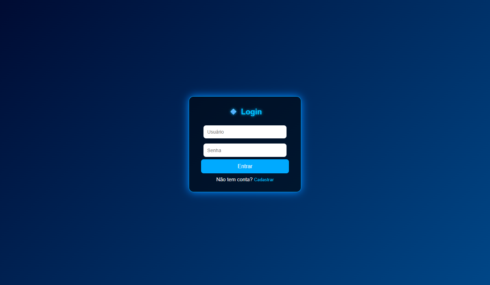
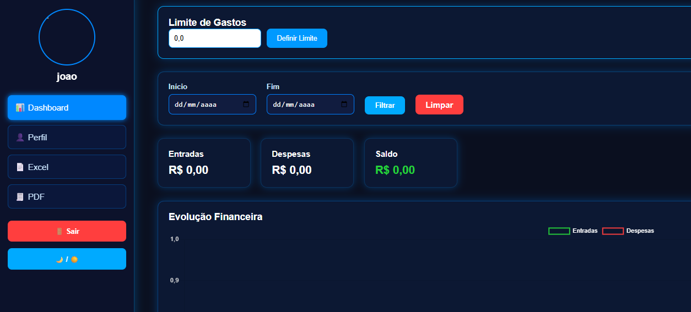
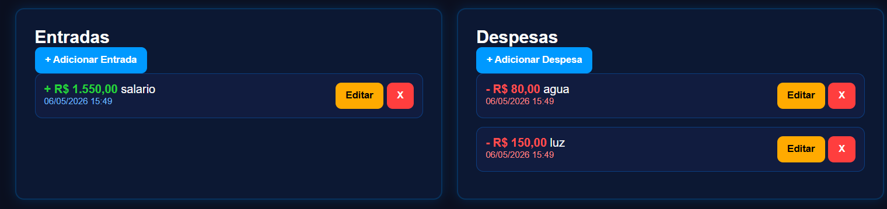
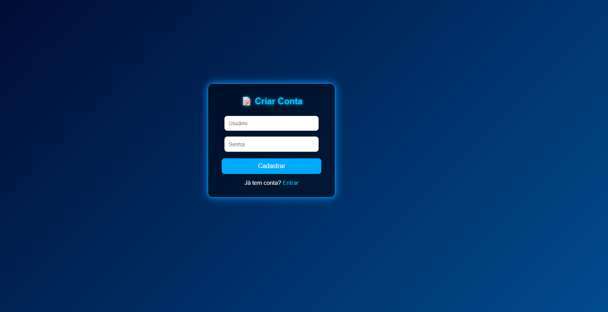

# Sistema de Controle Financeiro

Aplicação web desenvolvida com Python e Flask para gerenciamento de finanças pessoais.

### Tela de Login

### Dashboard

### Registro de Usuário

### Cadastro de Receita/Despesa

## Funcionalidades

- Cadastro de receitas e despesas
- Visualização dos dados financeiros
- Geração de relatórios em PDF
- Exportação de dados para Excel

## Tecnologias utilizadas

- Python
- Flask
- Pandas
- SQLite
- ReportLab
- OpenPyXL / XlsxWriter

## Como rodar o projeto

1. Clonar o repositório
  bash
  git clone https://github.com/seuusuario/sistema-financas.git
  cd sistema-financas

2. Criar ambiente virtual
  python -m venv venv
  venv\Scripts\activate

3. Instalar dependências
  pip install -r requirements.txt

4. Executar o projeto
  python app.py

5. Acessar no navegador
  http://127.0.0.1:5000s
